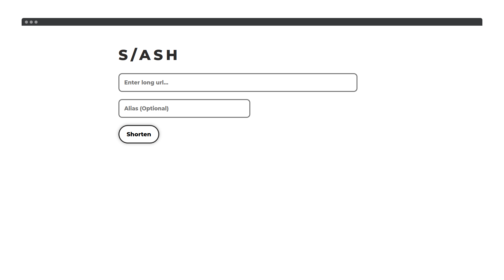
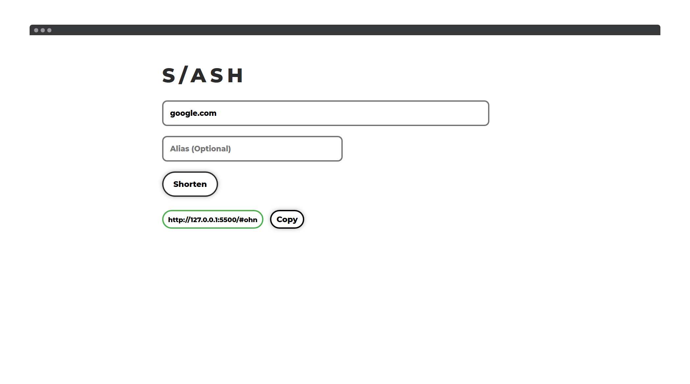

## 🔗  A simple custom URL shortener by [Sumit Kolhe](https://github.com/sumitkolhe)
---
#### :heart:  Also checkout [Reduced](https://github.com/sumitkolhe/Reduced) - A MEVN stack URL shortener with public API
---

   
  
  
   

### ✨  Features 

:heart: **Lightweight and minimalistic design**: Highly minimal and simple design

:rainbow: **Supports Custom Aliases**

:zap: **Easy to use**

:rocket: **Performance**: Slash is built using Vuejs, HTML5, and CSS3 which makes it lightning-fast and gives a great performance.

---

## 🖥️  Demo

[https://url.sumit.codes](https://url.sumit.codes)

1. Enter a long URL
2. Enter an alias if you want
3. Get a shortened link

You're done!

:warning: **Slash uses jsonbox.io which is an open service with public API endpoints. Do not use this service for shortening sensitive links.**

:sparkling_heart: **If you want a more secure and reliable custom URL shortener, checkout [Reduced](https://github.com/sumitkolhe/Reduced)**
---

## 🧰  Built with

* VueJS 

---

## ✍️  Authors

### Lead Developers
* [**Sumit Kolhe**](https://github.com/sumitkolhe) - *Author*

---

## 📜  License

This project is licensed under the [MIT License](https://opensource.org/licenses/MIT) - see the [LICENSE](LICENSE) file for details.

---
